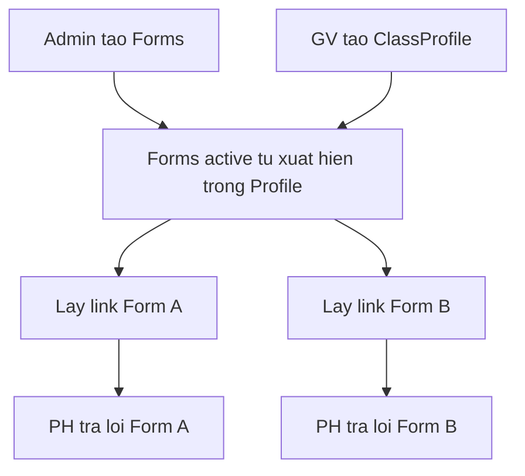

# Plan: Zalo Mini App — Hệ thống Form / Vote theo Profile lớp

Tài liệu theo dõi sản phẩm & kỹ thuật. Cập nhật khi có quyết định mới.

| Mục | Giá trị |
|-----|---------|
| Trạng thái | Phase 1 ~90% code; roadmap scale 2027→2029 (xem §5) |
| Đơn vị quản lý | **Class Profile** (lớp) × **Form**; vận hành **1 Form `active` / thời điểm** |
| Quy mô mục tiêu | Hết 2027 ~25K lớp; hết 2028 ~200K lớp; 2029 ~20M PH |
| Ví dụ Form đầu tiên | Đồng ý sử dụng Khan Academy (chỉ là 1 form mẫu, không phải toàn bộ hệ thống) |
| Zalo OA trong nghiệp vụ | **Không dùng chat OA để tạo vote / form** |
| Zalo OA về mặt nền tảng | **Vẫn cần OA doanh nghiệp** để gắn & xác thực chủ sở hữu Mini App |
| Chủ sở hữu | **Khan Academy Vietnam** — công ty/pháp nhân VN có ĐKKD (không phải CQNN) |
| Stack | **Laravel 13** (PHP ≥ 8.3) + MySQL (WAMP) + Zalo Mini App (React/Vite) |
| Pilot catalog | Tỉnh **Thanh Hóa** — wards từ `danh-sach-3321-xa-phuong.xls`; trường từ Excel CSGD (`schools.external_id` = cột ID) |
| Mẫu phiếu giấy | PDF upload trên Form (Admin); OCR theo layout Form hoặc checkbox mẫu |
| Tài liệu kỹ thuật | [00-overview-phases.md](./00-overview-phases.md) · [01-phase1-detail.md](./01-phase1-detail.md) · [02-technical-architecture.md](./02-technical-architecture.md) · [03-phase-progress.md](./03-phase-progress.md) |
| Trạng thái triển khai | Phase 1 đang làm — xem [03-phase-progress.md](./03-phase-progress.md) |

---

## 1. Mục tiêu & định vị sản phẩm

Xây dựng nền tảng thu thập **bình chọn** phụ huynh qua Zalo, gắn với **lớp học**.

- **Admin** tạo nhiều Form khác nhau theo thời gian (Khan Academy chỉ là form ví dụ đầu tiên).
- **Giáo viên chủ nhiệm** tạo **Profile lớp** một lần (địa lý, trường, tên lớp, sĩ số) — qua **Mini App hoặc web Laravel**. Lần đầu login Zalo **tự tạo** tài khoản GV (không whitelist).
- Trong Profile, các Form đang `active` **tự xuất hiện**; GV bấm tên form / Share Zalo / lấy link gửi group lớp.
- **Phụ huynh** mở link → bình chọn trong **Mini App** (nhị phân hoặc danh sách tùy chỉnh).

**Nguyên tắc MVP**

- Không bắt buộc roster từng học sinh; quản lý theo lớp + sĩ số.
- Mỗi PH Zalo trả lời **1 lần / (lớp × form)**.
- Form khóa khi **coverage** đạt sĩ số N (có trọng số khi 1 PH đại diện nhiều con).
- PH không Zalo: **upload ảnh phiếu** (không bắt buộc in từ hệ thống / mã phiếu) → OCR gợi ý theo lựa chọn Form → cô xác nhận.
- Audit log cho thao tác quan trọng.

---

## 2. Mô hình cốt lõi: Profile lớp × Form

```text
Admin tạo nhiều Forms (vote1, vote2, ...)
           │
           ▼
GV tạo Class Profile (1 lần / lớp)
  - Tỉnh / Xã / Trường / Tên lớp / Sĩ số N
           │
           ▼
Trong Profile: danh sách Forms active → mỗi form có link/QR riêng
           │
           ▼
PH mở link form A hoặc form B → trả lời độc lập
```



**Ví dụ**

1. Admin tạo Form: “Đồng ý dùng Khan Academy”.
2. Admin tạo thêm Form: “Khảo sát thiết bị học tập” (sau này).
3. Cô lớp 5A đã có Class Profile → **cả hai form đều hiện** trong profile (đúng phạm vi).
4. Cô copy link Form Khan gửi group; khi cần gửi tiếp link Form khảo sát — không tạo lại lớp.

---

## 3. Vai trò người dùng

| Role | Việc chính | Kênh UI (MVP) |
|------|------------|---------------|
| System Admin | CRUD Form, trường, khóa GV, dashboard theo Form, export, audit | **Web Laravel** |
| Giáo viên (Teacher) | Tạo Profile lớp, lấy link Form, ghi chú, upload giấy, thống kê + phiếu | **Mini App và Web Laravel** — đăng nhập **Zalo** (tự tạo tài khoản lần đầu) |
| Phụ huynh (Parent) | Mở link Form → bình chọn | **Mini App** |

---

## 4. Quyết định đã chốt

| Hạng mục | Quyết định |
|----------|------------|
| Đa Form (schema) | Hệ thống lưu được nhiều Form; **vận hành: 1 Form `active` tại một thời điểm** |
| Cách GV dùng | **Class Profile** + lấy link Form; UI: **Mini App + Web Laravel** (MVP cả hai) |
| Form mới vs lớp cũ | Form `active` **tự xuất hiện** trong mọi Class Profile đúng phạm vi — GV không cần đăng ký từng form |
| Đơn vị sĩ số | N nằm trên **Class Profile** (dùng chung); coverage tính **riêng theo từng Form** |
| Khóa Form trên lớp | `coverage(form, class) >= N` |
| PH nhiều con | Phase 1: mỗi phiếu `coverage_weight = 1`. Không note weight theo PH. Ghi chú tự do trên form lớp (nhiều bản + file). |
| Scope note nhiều con | Không áp Phase 1 (legacy `parent_coverage_notes` không dùng) |
| Chi tiết đã vote | GV (đúng lớp) + Admin xem phiếu (SĐT/Zalo, choice, thời gian, kênh) |
| Đổi ý PH | **Có** khi form lớp chưa đóng và Form admin còn active |
| Stack | **Laravel 13** + MySQL (WAMP); Mini App React/Vite |
| Phiếu giấy (Phase 1) | Upload **nhiều ảnh**; OCR theo lựa chọn Form; cô xác nhận. **Không** in mã/ID |
| Roster / vote theo HS | **BACKLOG** (mục 18) — không trên đường scale tới 20M |
| Sở / Phòng / Trường | **Không làm** — Admin trung ương + GV lớp |
| OA Zalo (nghiệp vụ) | **Không** dùng chat OA làm form tạo vote |
| OA Zalo (nền tảng) | **Có** — OA doanh nghiệp gắn Mini App |
| Đăng nhập GV | **Zalo Login** — tự provision; Admin khóa nếu cần. Không mật khẩu riêng |
| Đăng nhập Admin web | Email/mật khẩu Laravel |
| Tùy chọn Form | Preset Đồng ý/Không · Có/Không · **Tùy chỉnh** (không giới hạn số lựa chọn, min 2) |
| Đóng Form admin | Cascade đóng mọi `class_form`; mở lại Form → cascade reopen |
| Quy mô | Hết 2027 ~25K lớp; hết 2028 ~200K lớp; 2029 ~20M PH |

---

## 5. Phases triển khai

> Board sống: [03-phase-progress.md](./03-phase-progress.md). Overview: [00-overview-phases.md](./00-overview-phases.md).

### Mục tiêu quy mô

> Mốc năm = lúc hệ thống **đạt tới**; phần chuẩn bị phải **xong trước 1 năm**.

| Mốc đạt tới | Lớp | PH (≈ 50/lớp) | Phase phải xong trước |
|-------------|-----|---------------|-----------------------|
| Hết **2027** | ~**25.000** | ~**1,25 triệu** | **2** Hardening (hết 2026) |
| Hết **2028** | ~**200.000** | ~**10 triệu** | **3** Scale mid (hết 2027) |
| **2029** | (~400K nếu ~50 PH) | ~**20 triệu** | **4** Full capacity (hết 2028) |

```text
Chuẩn bị:  Phase 0–1 ──► Phase 2 ──► Phase 3 ──► Phase 4
            2026         hết 2026    hết 2027    hết 2028
Đạt tới:                 25K(2027)   200K(2028)  20M(2029)
```

### Phase 0 — Chuẩn bị (2026)

- **Tạo / xác thực Zalo OA doanh nghiệp** (Khan Academy Vietnam) + đăng ký Mini App (chi tiết mục 19)
- Cấu hình quyền API Mini App (lấy user id, SĐT nếu được cấp)
- Mẫu phiếu giấy PDF — **không sinh mã/ID trên phiếu**
- Import danh mục pilot: Tỉnh → Xã → Trường
- Backend Laravel deploy URL **HTTPS** công khai

### Phase 1 — MVP Pilot (2026, code ~90%)

- Admin: Form; khuyến nghị **1 Form active / đợt**
- GV: Class Profile; lấy link/QR — Mini App + web Laravel
- PH: bình chọn Mini App (nhị phân hoặc radio tùy chỉnh)
- Upload giấy hàng loạt: OCR → xác nhận (không mã phiếu)
- Dashboard theo Form; export CSV; audit VN
- **Không làm trên critical path:** roster HS, Sở–Phòng, Form builder phức tạp

### Phase 2 — Hardening production (chuẩn bị xong hết 2026)

Sẵn sàng cho ~**25.000 lớp** / ~**1,25M PH** (đạt tới 2027):

- Redis, object storage (S3), queue workers OCR/export
- Coverage counter atomic; multi-app + LB; backup + monitoring
- Enforce **1 Form `active`**; throttle theo user/token
- Export async; import trường theo đợt; load test

### Phase 3 — Scale mid (chuẩn bị xong hết 2027)

Sẵn sàng cho ~**200.000 lớp** / ~**10M PH** (đạt tới 2028):

- Read replica; stats materialize theo Form đang mở
- CDN; archive audit/ảnh cũ; autoscaling; runbook campaign

### Phase 4 — Full capacity (chuẩn bị xong hết 2028)

Sẵn sàng cho ~**20 triệu PH** (đạt tới 2029):

- Capacity peak; DR; tối ưu Zalo session; (tuỳ) partition `responses`
- Pre-aggregate theo trường/tỉnh cho Form đang chạy

### BACKLOG (không chặn scale)

- Roster HS + phiếu in có mã (mục 18) — chỉ khi cần gắn từng học sinh
- Reminder coverage, reviewer giấy, Form đa câu hỏi, OA broadcast
- **Không làm:** phân quyền Viewer Sở / Phòng / Trường

---

## 6. Luồng nghiệp vụ chi tiết

### 6.1 Admin tạo Form (Vote)

Mỗi Form là một “cuộc thu thập” độc lập, ví dụ:

- Form #1: Đồng ý dùng Khan Academy  
- Form #2: … (các đợt sau)

Trường thông tin Form:

1. Tên, mô tả, nội dung hiển thị PH  
2. `starts_at` / `ends_at` / **không kết thúc**  
3. Status: `draft` → `active` → `closed`  
4. Tùy chọn kết quả: Đồng ý/Không · Có/Không · tùy chỉnh (nhiều lựa chọn)  
5. Mẫu PDF phiếu giấy + calibrate OCR (tuỳ chọn)  
6. Phạm vi: catalog đã import (pilot Thanh Hóa)  

Khi Form `active`: mọi Class Profile **thấy Form** và có thể `ensure` (lazy tạo `class_form`). Admin **đóng** Form → mọi `class_form` liên quan `closed`. Admin **mở lại** → cascade reopen.

### 6.2 GV tạo Class Profile (một lần / lớp)

1. Đăng nhập Mini App / web → role Teacher (Zalo; lần đầu tự tạo tài khoản)  
2. Tạo Profile: Tỉnh → Xã → Trường → Tên lớp → Sĩ số N  
3. Màn «Form đang mở» liệt kê Form `active` + coverage từng Form. Một lớp: không hiện bộ lọc lớp. Một lớp × một form: vào thẳng chi tiết (`?list=1` để xem list).  
4. Bấm tên form (kể cả chưa có link) → `ensure` → trang chi tiết.

### 6.3 GV lấy link Form

1. Vào form đang mở → bấm tên form hoặc Share Zalo  
2. Hệ thống `ensure` `class_form` (tạo mới hoặc mở lại nếu từng bị cascade đóng; **không đổi token**)  
3. Copy link / Tải QR / Share Zalo → gửi group  

Mỗi cặp (Profile × Form) = **một link riêng**, cố định đến khi đóng. Mini App không hiện ảnh QR trên màn (có nút Tải QR); web vẫn hiện QR.

### 6.4 PH trả lời Form

1. Mở link → xác thực Zalo → load Form + thông tin lớp + thống kê  
2. Kiểm tra Form còn hạn; `class_form` còn mở  
3. Form nhị phân: chọn 1 trong 2 nút. Form tùy chỉnh: chọn radio **Bình chọn của bạn** rồi bấm **Bình chọn**  
4. Unique: một `zalo_user_id` chỉ 1 response / `class_form`; được **đổi ý** khi còn mở  

### 6.5 Ghi chú + quyền sửa phiếu

1. **Giáo viên không được sửa kết quả phụ huynh** đã bình chọn (chỉ xem).  
2. GV thêm **nhiều ghi chú** + file trên form lớp; được xóa ghi chú / phiếu giấy do chính mình tải khi form còn mở.  
3. Mỗi phiếu Phase 1: `coverage_weight = 1`.  
4. **Phụ huynh được đổi ý** khi `class_form` chưa `closed` và Form còn `isActive`. Không nhận phiếu Zalo **mới** nếu `quota_full`, nhưng vẫn cho đổi ý phiếu đã gửi.

### 6.6 Phiếu giấy — Phase 1 (không mã ID, upload nhiều ảnh)

**Không cần:** hệ thống in phiếu có mã / ID học sinh.

**Luồng hàng loạt:**

1. GV tải mẫu PDF chung của Form (checkbox vị trí cố định) → in/photo copy ngoài hệ thống.  
2. GV vào Profile → Form → **chọn nhiều ảnh** một lần (multi-upload).  
3. Hệ thống OCR **từng ảnh** → gợi ý theo lựa chọn Form (`unknown` nếu không đọc được).  
4. UI: từng ảnh + gợi ý (sửa từng dòng) + tóm tắt theo label Form / Không rõ.  
5. Cô bấm xác nhận → hệ thống tạo từng `response` paper tương ứng (mỗi ảnh hợp lệ = 1 phiếu, `coverage_weight=1`).  
6. Ảnh OCR fail: dòng đó bắt buộc chọn tay hoặc bỏ qua (không ép lưu sai).

OCR chỉ đọc checkbox kết quả — không đọc thông tin học sinh.

### 6.6b Phiếu giấy — BACKLOG roster (có mã ID, gắn học sinh)

Chỉ áp khi kick-off mục 18 (không trên đường scale 2027–2029):

1. GV chọn các HS cần phiếu giấy → hệ thống **sinh & in phiếu** (mã `paper_code` / QR + tên HS + checkbox).  
2. PH đánh dấu → cô chụp (có thể nhiều ảnh).  
3. OCR/đọc mã: **paper_code + kết quả Đồng ý/Không**.  
4. Lưu `response` gắn `student_id` + `paper_code` (unique); cô xác nhận nếu confidence thấp.

### 6.7 Đóng Form trên lớp / đóng Form toàn cục

- `coverage >= N` → `class_form.status = quota_full`  
- GV có thể đóng sớm một Form trên lớp  
- Form Admin `closed` / hết hạn → mọi `class_form` liên quan dừng nhận response  
- Sửa sĩ số Profile: chỉ cho phép nếu không làm coverage hiện tại của Form đang mở vượt logic an toàn (MVP: chỉ tăng N hoặc chặn giảm dưới max coverage các form đang mở)

---

## 7. Rule quota & chống gian lận

```text
coverage(class_form) = SUM(coverage_weight) của responses valid
weight Phase 1 = 1
khóa phiếu mới khi coverage >= class_profile.quota
```

| Rule | Chi tiết |
|------|----------|
| Token / link | Mỗi `class_form` có `invite_token` riêng; đóng/mở lại **không đổi** mã |
| Unique PH | `(class_form_id, zalo_user_id)` |
| Đa Form độc lập | Cùng PH vote Form A không chặn Form B |
| Atomic | Transaction không vượt quota |
| Unique giấy Phase 1 | Không mã phiếu; cô không upload trùng; hash ảnh cảnh báo mềm (nếu có) |

---

## 8. Mô hình dữ liệu (logic)

```text
forms
  id, title, content, starts_at, ends_at, no_end_date, status,
  consent_pdf_path, options_json, ocr_layout_json, scope_json

provinces / wards / schools

teachers
  zalo_id, phone, name, school_id, status   -- tự tạo lúc login Zalo

class_profiles
  id, school_id, class_name, quota, created_by_teacher_id, status

class_forms
  id, class_profile_id, form_id,
  invite_token, invite_token_hash, status (open | quota_full | closed)
  UNIQUE(class_profile_id, form_id)

class_form_notes
  id, class_form_id, body, file_path, created_by_teacher_id, timestamps

responses
  id, class_form_id, channel (zalo | paper),
  choice VARCHAR(32),   -- value trong options_json
  zalo_user_id NULL, phone NULL,
  coverage_weight INT DEFAULT 1,
  image_path NULL, ocr_suggestion NULL, ocr_confidence NULL,
  status (valid | void)

audit_logs
  actor, action, entity, payload, created_at
```

Chi tiết cột / API: [02-technical-architecture.md](./02-technical-architecture.md).  
`parent_coverage_notes` (nếu còn bảng) **không dùng** Phase 1.

---

## 9. Màn hình

### Giáo viên — 2 UI, cùng nghiệp vụ

| Tính năng | Mini App | Web Laravel |
|-----------|----------|-------------|
| Tạo / sửa Class Profile | Có | Có |
| Xem Form + Copy link / Share Zalo / Tải QR | Có (không hiện ảnh QR) | Có (có QR trên màn) |
| Thống kê Form + danh sách phiếu | Có (stacked bar) | Có |
| Ghi chú + file | Có | Có |
| Upload phiếu giấy + OCR confirm | Có (modal) | Có (popup) |
| Đóng Form trên lớp | Có | Có |

**Nguyên tắc:** một backend/API; không hai bộ rule. Web tiện máy tính; Mini App tiện khi cô đang trên điện thoại trong group Zalo.

**Đăng nhập web Teacher:** **Zalo Login** → tự tạo `teachers` theo `zalo_id`. **Không** username/password. Cùng Zalo dùng Mini App và web.

**Đăng nhập Admin:** email/mật khẩu Laravel.

### Giáo viên (chi tiết màn)

1. Form đang mở theo lớp (ẩn lọc lớp nếu chỉ 1 lớp)  
2. Tạo Profile lớp  
3. Chi tiết Form: thống kê + link + ghi chú/giấy + đóng Form  

### Phụ huynh (Mini App)

1. Landing theo link Form  
2. Nội dung + thống kê lớp  
3. Nhị phân: 2 nút. Tùy chỉnh: **Bình chọn của bạn** (radio) + nút **Bình chọn**  
4. Đã gửi / hết suất / hết hạn / đổi ý  

### Admin (Laravel Web)

1. CRUD Form (options, PDF, OCR calibrate)  
2. Import trường Excel  
3. Khóa / xem GV (không whitelist trước)  
4. Dashboard theo Form + export  
5. Audit tiếng Việt  
6. Quản lý tài khoản admin  

---

## 10. Dashboard & báo cáo

- Chọn **Form** → lọc Tỉnh / Xã / Trường  
- Mỗi dòng lớp: coverage / N, kết quả theo lựa chọn Form, trạng thái  
- Chi tiết lớp × Form: danh sách phiếu  
- Export theo Form

---

## 11. Kiến trúc kỹ thuật

```text
Zalo Mini App (React)          Web Laravel 13
  - Phụ huynh vote               - Admin (password)
  - Giáo viên (mobile)           - Giáo viên (Zalo Login desktop)
              \                   /
               v                 v
              Laravel 13 API + MySQL + Storage ảnh
```

**Auth**

- Parent Mini App: Zalo session → Sanctum  
- Teacher Mini App **và** web: **Zalo Login** → tự tạo `teachers`  
- Admin web: email/mật khẩu  
- Teacher chỉ thấy lớp của mình  

**Lưu ý Zalo Login web:** callback domain trên Developers = `APP_URL` (local: `http://miniapp.kav/teacher/zalo/callback`).

Chi tiết API/schema: [02-technical-architecture.md](./02-technical-architecture.md).

---

## 12. Sprint MVP — đã qua (tham chiếu lịch sử)

W1–W4 code xong (bootstrap, profile/vote, giấy OCR, dashboard/export, admin redesign).  
Còn: UAT, HTTPS, Mini App Live, pilot — xem [03-phase-progress.md](./03-phase-progress.md).

---

## 13. Tiêu chí thành công pilot

- Admin tạo ≥ 2 Form; cả hai hiện trong Profile lớp cũ không cần tạo lại lớp  
- GV lấy link từng Form &lt; 1 phút sau khi có Profile  
- Coverage / unique đúng (weight = 1)  
- Phiếu giấy đúng Form (nhị phân hoặc tùy chỉnh)  
- Dashboard tách số liệu theo từng Form  

---

## 14. Vận hành

- Hướng dẫn GV: tạo Profile một lần → mở form đang mở → Share Zalo / copy link → giấy nếu cần  
- FAQ: khác Form khác link; đã vote Form A vẫn vote được Form B; 1 lớp không hiện bộ lọc lớp  
- Sự cố: không rotate token khi đóng/mở; Admin đóng Form thì PH không vote được  

---

## 15. Pháp lý

1. Cơ sở thu thập dữ liệu theo từng Form  
2. Thời hạn lưu & quyền export  
3. Giá trị pháp lý digital vs giấy  
4. Rút phiếu / void  
5. Điều khoản hiển thị trên từng Form  

---

## 16. Roadmap sau MVP

**Critical path (scale):** Phase 2 (2027) → Phase 3 (2028) → Phase 4 (2029) — xem §5.

**Backlog tuỳ nhu cầu (không chặn 20M):**

- Roster + phiếu mã (mục 18)
- Reminder thiếu coverage; reviewer giấy tập trung
- Form builder đa câu hỏi
- Webhook kết quả Form → hệ thống ngoài (vd. cấp quyền Khan)
- OA broadcast / OpenAPI

**Không làm:** phân quyền Sở / Phòng / Trường.

---

## 17. Lịch sử thay đổi tài liệu

| Ngày | Thay đổi |
|------|----------|
| 2026-08-11 | Bản đầu: class-level vote kiểu campaign đơn |
| 2026-08-11 | PH nhiều con: vote 1 lần + `coverage_weight` |
| 2026-08-11 | **Sửa rule:** bỏ weight note theo PH; GV **không sửa phiếu**; 1 `teacher_note`/class_form khi thiếu coverage; PH **đổi ý** khi form mở |
| 2026-08-11 | **Đa Form**; Khan chỉ là ví dụ; mô hình **Class Profile** + Form tự hiện, GV lấy link |
| 2026-08-11 | GV + Admin xem thống kê Form và **chi tiết từng SĐT đã vote** |
| 2026-08-11 | Roster Excel = đầu chờ; không đưa vào schema MVP |
| 2026-08-11 | Làm rõ OA doanh nghiệp KAV; checklist mục 19; gói OA Cơ bản → Tăng trưởng khi cần OpenAPI |
| 2026-08-11 | GV dùng **cả Mini App và web Laravel** |
| 2026-08-11 | Phiếu giấy Phase 1: không mã; OCR + xác nhận |
| 2026-08-11 | Phase 1: **upload nhiều ảnh**, tóm tắt mấy Đồng ý/Không; chính thức hóa **Phase 4** roster + phiếu in có mã ID (có thể làm trước Phase 2) |
| 2026-08-11 | GV web Laravel: **đăng nhập Zalo**, không tạo tài khoản mật khẩu; Admin vẫn email/password |
| 2026-08-11 | Chốt stack **Laravel 13**; bổ sung bộ docs kỹ thuật `00`–`03` + agents/rules/skills |
| 2026-08-11 | Seed Thanh Hóa; `schools.external_id`; mẫu phiếu có tick Đồng ý/Không; kick-off Phase 1 web |
| 2026-08-12 | Admin redesign: bỏ whitelist; dashboard theo Form; `options_json`; import Excel trường; audit VN |
| 2026-08-13–14 | OCR calibrate theo Form; Mini App OCR confirm; copy «bình chọn»; form tùy chỉnh radio; cascade đóng/mở Form; API Mini App = `miniapp.kav` |
| 2026-08-14 | Roadmap scale: Phase 2=hardening 25K lớp (hết 2027); Phase 3=200K lớp/~10M PH (hết 2028); Phase 4=full ~20M (2029). 1 Form active. Bỏ Sở–Phòng. Roster → backlog §18. |
| 2026-08-14 | Mốc năm = lúc **đạt tới**; chuẩn bị lùi trước 1 năm → Phase 2 xong hết 2026, Phase 3 xong hết 2027, Phase 4 xong hết 2028. |

---

## 18. BACKLOG — Danh sách học sinh + vote theo HS + phiếu giấy có mã

> **Trạng thái:** Định nghĩa sẵn; **không** trên critical path scale 2027–2029.  
> Phase 2–4 hiện tại = hardening / scale mid / full capacity (xem §5). Kick-off roster chỉ khi KAV yêu cầu gắn từng học sinh.

### Phạm vi (khi kick-off)

1. **Upload Excel** danh sách HS vào Class Profile (họ tên, mã HS tùy chọn; đồng bộ / cập nhật `quota`).  
2. Form chế độ `per_student`: PH mở link → **chọn học sinh** → Đồng ý/Không.  
3. Unique: **1 học sinh / class_form** (1 PH có thể vote nhiều con).  
4. Coverage: đếm số HS đã có response hợp lệ.  
5. Note `coverage_weight` trên Profile: giảm vai trò (chỉ fallback nếu còn mode cũ).  
6. **Phiếu giấy có mã:**
   - Cô chọn HS chưa vote / cần giấy → hệ thống sinh PDF/phiếu **có `paper_code` (và/hoặc QR)** gắn `student_id`  
   - Cô in → PH đánh dấu → chụp (có thể nhiều ảnh)  
   - Hệ thống đọc **mã ID + kết quả Đồng ý/Không** → map đúng HS; cô xác nhận nếu OCR thấp  
7. Chi tiết vote: SĐT (online) / paper_code + tên HS + kết quả  

### Schema bổ sung khi kick-off backlog roster

```text
students
  id, class_profile_id, full_name, student_code NULL, ...

paper_slips                    -- phiếu đã phát hành để in
  id, class_form_id, student_id, paper_code UNIQUE, status (issued|used|void)

responses
  + student_id
  + paper_code                 -- bắt buộc với channel=paper khi dùng roster
```

Phase 1 **không** tạo các bảng/cột này. Kick-off backlog mới thêm.

### So sánh nhanh Phase 1 vs backlog roster (giấy)

| | Phase 1 (đường scale) | Backlog roster |
|--|----------------------|----------------|
| Danh sách HS | Không | Excel upload |
| Vote online | Theo SĐT / 1 PH 1 lần | Theo học sinh |
| In phiếu từ hệ thống | Không (mẫu chung) | **Có**, theo từng HS |
| Mã ID trên phiếu | Không | **Có** — OCR đọc kèm kết quả |
| Upload nhiều ảnh | Có + đếm theo lựa chọn Form | Có + map theo mã ID |

---

## 19. Zalo OA & checklist đẩy Mini App

### 19.0 Chủ sở hữu đã chốt

- Đơn vị: **Khan Academy Vietnam**
- Loại hình xác thực Zalo: **Doanh nghiệp / pháp nhân VN có ĐKKD** — **không** dùng quy trình Cơ quan nhà nước (`minicqnn`, công văn CQNN).
- Nghiệp vụ thu thập ý kiến trong trường học **không** buộc Mini App phải là app CQNN; nội dung giáo dục vẫn cần mô tả rõ mục đích + chính sách dữ liệu khi nộp duyệt.

### 19.1 Có gì khác so với giả định “CQNN/giáo dục công”?

| Hạng mục | Giả định cũ (CQNN) | Thực tế (Khan Academy Vietnam – DN) |
|----------|--------------------|-------------------------------------|
| Loại OA | OA cơ quan nhà nước / tiện ích công | **OA doanh nghiệp** |
| Hồ sơ xác thực | Quyết định thành lập, công văn CQNN | **ĐKKD + CCCD người đại diện pháp luật** (+ giấy tờ Zalo yêu cầu thêm nếu có) |
| Kênh hỗ trợ Zalo | `minicqnn@zalo.me` / OA Chuyển đổi số | Hỗ trợ Mini App thương mại / doanh nghiệp (xem portal Zalo tại thời điểm nộp; thường khác kênh CQNN) |
| Duyệt nội dung | Nhấn mạnh tiện ích công | Nhấn mạnh **DN cung cấp dịch vụ/giải pháp giáo dục**, thu thập đồng ý PH; giải trình xử lý SĐT rõ ràng |
| Nghiệp vụ Form/Profile trong plan | Không đổi | **Không đổi** |

**Phần sản phẩm trong plan (Profile × Form, vote, giấy, SĐT…) giữ nguyên.** Chỉ đổi **hồ sơ pháp lý + loại OA** khi đưa lên Zalo.

### 19.2 Plan này có cần Zalo OA không?

| Việc | Cần OA? |
|------|---------|
| Cô nhắn tin OA để tạo vote (chat/bot) | **Không** |
| Phát hành Mini App cho GV/PH | **Có** — gắn OA doanh nghiệp đã xác thực |
| Thông báo OA hàng loạt | Tuỳ chọn Phase sau |
| Lấy SĐT | Cần quyền Mini App + điều khoản / mục đích trong hồ sơ duyệt |

Trạng thái: **chưa có OA** → tạo **OA doanh nghiệp Khan Academy Vietnam** là việc Phase 0 ưu tiên.

### 19.3 Việc cần làm để đẩy lên Zalo Mini App (lộ trình DN)

**A. Pháp lý / tài khoản (KAV — làm sớm)**

1. Chuẩn bị **Giấy ĐKKD** (bản scan) + **CCCD** người đại diện pháp luật.  
2. Tạo **Zalo OA doanh nghiệp** (tên thương hiệu khớp / giải trình được quan hệ với pháp nhân).  
3. **Xác thực OA doanh nghiệp** trên cổng quản trị OA.  
4. Tài khoản admin/developer đã **eKYC**.  
5. Trên cổng Mini App: tạo app → **xác thực chủ sở hữu bằng OA doanh nghiệp** (hoặc upload ĐKKD + CCCD nếu Zalo cho phép hình thức giấy tờ — ưu tiên gắn OA đã verify).  
6. Admin OA **xác nhận** yêu cầu liên kết Mini App trong hạn Zalo quy định.

**B. Tạo Mini App trên cổng Zalo**

1. [Zalo for Developers](https://developers.zalo.me/) / cổng Mini App → tạo **Zalo App** → **App ID** + **App Secret**.  
2. Tạo **Mini App** trong App đó → **Mini App ID**.  
3. **Loại hình sở hữu: Doanh nghiệp** (không chọn Cá nhân lâu dài; tuyệt đối không CQNN) — xem §19.5.  
4. Điền tên / icon / mô tả (xem [04-zalo-miniapp-setup.md](./04-zalo-miniapp-setup.md)).  
5. Cấu hình quyền (user info, SĐT nếu được cấp).  
6. Thêm Admin / Developer / Người dùng thử nghiệm; Testing bằng QR.  
7. Khi có OA: gắn OA DN → xác nhận → nộp duyệt Live.

**C. Kỹ thuật**

1. Frontend Mini App (React + SDK Zalo).  
2. Backend Laravel **HTTPS** miền thật.  
3. Env theo App ID; bản testing bằng QR / tester list.

**D. Nộp duyệt & phát hành**

1. Chính sách quyền riêng tư + điều khoản thu thập SĐT / phiếu đồng ý / ảnh chữ ký.  
2. Screenshot, mô tả use-case giáo dục rõ (không mập mờ thương mại nhạy cảm).  
3. Nộp duyệt (thường **3–5 ngày làm việc**).  
4. Sau duyệt: link/QR đưa vào Zalo Group lớp. Zalo Store công khai = tuỳ chọn.

### 19.4 Phân việc

| Việc | Ai |
|------|-----|
| ĐKKD, CCCD đại diện, tạo & verify OA DN | **Khan Academy Vietnam** |
| Liên kết OA ↔ Mini App, nộp duyệt | **KAV** (+ dev hỗ trợ kỹ thuật) |
| Code Mini App + Laravel | **Dev** |
| Domain HTTPS / server | **Dev / IT KAV** |
| Nội dung Form, mẫu phiếu PDF | **KAV nghiệp vụ** |
| Whitelist GV pilot | **Không** — GV tự login Zalo; Admin khóa nếu lạm dụng |

### 19.5 Loại hình sở hữu Mini App — chọn gì?

Trên form tạo Mini App, Zalo thường có **3 lựa chọn**. Với KavMiniApp / Khan Academy Vietnam:

| Lựa chọn trên form | Chọn? | Lý do |
|--------------------|-------|--------|
| **Doanh nghiệp** / pháp nhân | **Có — chọn cái này** | Chủ sở hữu đã chốt là DN KAV (ĐKKD), gắn OA doanh nghiệp sau |
| Cá nhân | Không (trừ khi form bắt buộc tạm và sẽ đổi/verify lại DN trước Live) | App Live phải thuộc pháp nhân KAV, không gắn danh nghĩa cá nhân lâu dài |
| Cơ quan nhà nước / CQNN | **Không bao giờ** | Không đi quy trình `minicqnn`, công văn CQNN |

**Khuyến nghị thao tác ngay lúc tạo:** chọn **Doanh nghiệp**.  
Xác thực có thể làm sau bằng:

1. **Ưu tiên:** gắn **OA doanh nghiệp KAV** đã verify → Admin OA xác nhận, hoặc  
2. Upload **ĐKKD + CCCD** người đại diện (nếu Zalo cho phép khi chưa có OA).

Dev/Testing (QR nội bộ) vẫn làm được trong lúc chờ xác thực DN/OA xong; **Publish Live** thì cần xác thực chủ sở hữu xong.

Chi tiết thao tác tạo App / Mini App / redeploy: xem [04-zalo-miniapp-setup.md](./04-zalo-miniapp-setup.md).

### 19.6 Gói Zalo OA cần đăng ký (theo bảng giá OA)

Nguồn: bảng So sánh các gói dịch vụ Zalo OA (Cơ bản / Tiêu chuẩn / Tăng trưởng / Toàn diện).

| Nhu cầu | Gói tối thiểu theo bảng | Ghi chú |
|---------|-------------------------|---------|
| Chỉ chạy **Mini App** (MVP đã chốt: chưa gửi tin OA / OpenAPI) | **Cơ bản (miễn phí)** — thử trước | Bảng ghi “Số lượng App được ủy quyền: 1” kể cả gói Cơ bản; **không có** Tích hợp Zalo OpenAPI |
| Cần **Zalo OpenAPI** (gửi tin OA, gọi API OA từ server) | **Tăng trưởng** trở lên | OpenAPI: Cơ bản/Tiêu chuẩn = không có; Tăng trưởng = 100 req/phút; Toàn diện = 2000 req/phút |
| Nhiều app ủy quyền / traffic OpenAPI rất lớn | **Toàn diện** | App ủy quyền không giới hạn; 2000 req/phút |

**Khuyến nghị cho Khan Academy Vietnam (đã chốt MVP chỉ Mini App):**

1. Đăng ký / dùng **OA doanh nghiệp gói Cơ bản** để tạo OA, xác thực pháp nhân, gắn Mini App và nộp duyệt.  
2. **Không bắt buộc** mua Tăng trưởng/Toàn diện chỉ để có Mini App trong giai đoạn này.  
3. Khi sau này cần nhắc PH / gửi tin qua OA API → nâng lên **Tăng trưởng** (đủ cho pilot–soft launch); xét **Toàn diện** khi OpenAPI thật sự nghẽn (gần ngưỡng 100 req/phút hoặc cần nhiều app).  
4. Gói **Tiêu chuẩn** (1 triệu/12 tháng): có thêm công cụ chat/bài viết nhưng **vẫn không có OpenAPI** — chỉ nên mua nếu muốn tool chăm sóc OA, không phải điều kiện Mini App.

**Lưu ý:** Chính sách gắn Mini App ↔ gói OA có thể đổi trên cổng Zalo. Khi tạo Mini App, đối chiếu lại trên Developers/Mini App Center; nếu Zalo bắt buộc gói có OpenAPI mới gắn được app thì nâng **Tăng trưởng**.
